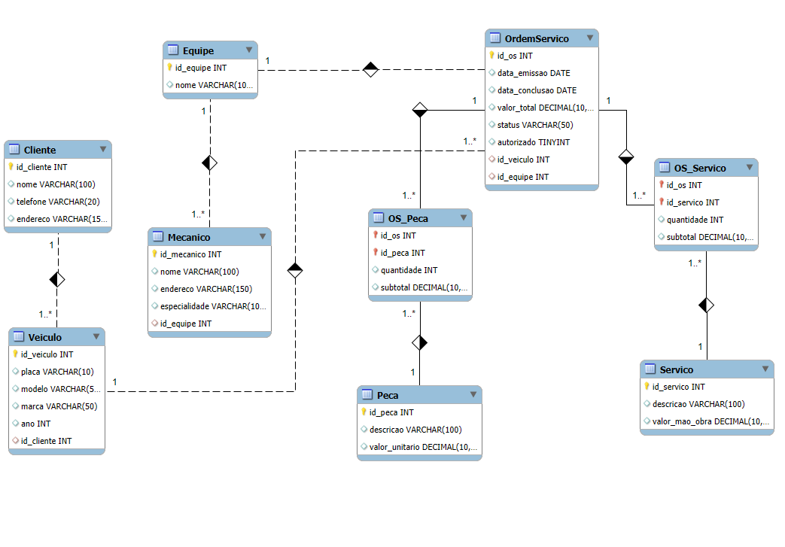

# Modelo Conceitual - Sistema de Ordem de Serviço para Oficina

Este repositório apresenta o modelo conceitual de banco de dados desenvolvido para um sistema de gerenciamento de ordens de serviço em uma oficina mecânica.

## 📌 Descrição do Projeto

O objetivo do sistema é organizar e automatizar as ordens de serviço (OS), fornecendo uma visão clara das relações entre clientes, veículos, serviços prestados, mecânicos e pagamentos.

O modelo contempla:

- Cadastro de clientes (pessoa física e jurídica)
- Cadastro de veículos com associação ao cliente
- Registro de ordens de serviço e seus respectivos serviços
- Controle de mecânicos responsáveis
- Histórico de serviços realizados por veículo
- Informações de pagamento associadas à OS

# 🔧 Sistema de Gestão de Ordens de Serviço - Oficina Mecânica

## 📘 Descrição do Projeto

Este projeto apresenta um modelo conceitual e lógico de banco de dados para um sistema de **controle e gerenciamento de ordens de serviço** em uma **oficina mecânica**. O objetivo é registrar todas as informações relacionadas aos serviços realizados, equipes envolvidas, veículos atendidos e peças utilizadas.

## 🎯 Objetivo

Modelar um banco de dados relacional para representar de forma eficiente o fluxo de trabalho da oficina, desde a entrada do cliente e seu veículo, até a execução e finalização dos serviços.

## 🧱 Entidades Principais

- **Cliente:** Dados do cliente que leva o veículo à oficina.
- **Veículo:** Informações do carro pertencente ao cliente.
- **Equipe:** Grupo de mecânicos responsável pela execução da ordem de serviço.
- **Mecânico:** Profissionais com especialidades específicas, vinculados a uma equipe.
- **Ordem de Serviço (OS):** Documento que representa os serviços a serem executados.
- **Serviço:** Atividades que podem ser realizadas em um veículo, com custo de mão de obra.
- **Peça:** Componentes usados na manutenção ou conserto de veículos.

## 🔗 Relacionamentos

- Cada **cliente** pode ter vários **veículos**.
- Cada **veículo** pode gerar várias **ordens de serviço**.
- Cada **ordem de serviço** é atribuída a uma **equipe**.
- Cada **equipe** pode ter vários **mecânicos**.
- Uma **ordem de serviço** pode conter vários **serviços** e várias **peças**.
- Os custos de mão de obra e peças compõem o valor total da OS.

## 🛠️ Tabelas Associativas

- **OS_Servico:** Relaciona os serviços executados em cada OS.
- **OS_Peca:** Relaciona as peças utilizadas em cada OS.

## 📌 Observações

- O modelo assume que o cliente autoriza previamente os serviços executados.
- Os relacionamentos foram modelados com base em práticas comuns em oficinas mecânicas, onde equipes fixas realizam todo o processo.
- Algumas decisões de modelagem foram assumidas para cobrir lacunas da narrativa, como: 
  - Cadastro de peças com valor unitário;
  - Subtotal de cada item para facilitar cálculos e relatórios;
  - Campo `autorizado` como booleano para controle da execução.


## 🗂️ Diagrama Entidade-Relacionamento

Abaixo está o diagrama ER que representa o modelo conceitual:




## 🧪 Tecnologias

- Modelo criado com **MySQL Workbench**.
- Script SQL disponível na pasta `/sql`.

## 📂 Estrutura

```
/sql
  └── modelo_oficina.sql

/modelo
  └── diagrama.mwb (opcional)

README.md
```
